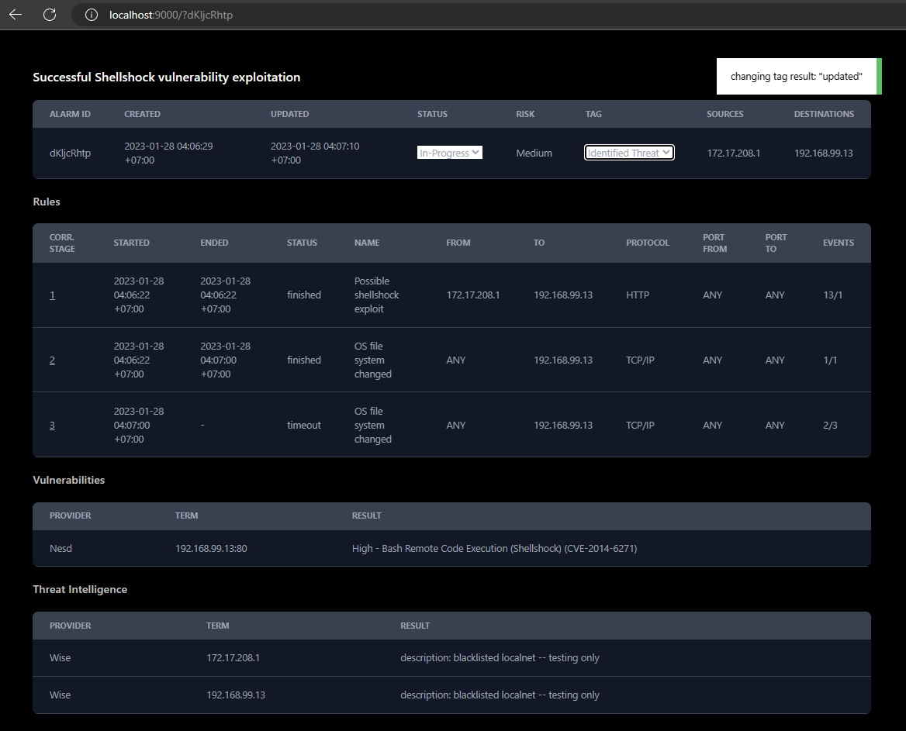

# Dsiem Rust UI
[](https://github.com/mmta/dsiem-rustui/actions/workflows/publish.yml)

This is an experimental [Yew](https://yew.rs/)-based WebAssembly app for managing alarms in [Dsiem](https://github.com/defenxor/dsiem). The aim is to replace the existing Angular [web UI](https://github.com/defenxor/dsiem/blob/master/docs/web_interfaces.md#dsiem-web-ui) with something that will have fewer dependabot warnings over time.

This app has fewer functionalities (and much smaller download) than the existing web UI. The only available functions are:
- Single alarm view: linking alarm with its associated events in one page.
- Alarm update: `tag` and `status` update through drop-down menu.

That said, it is fully usable for those doing most of their analysis in Kibana/Opensearch Dashboard, and only pivoting to Dsiem web UI for changing alarm's `tag` and `status`.

Example screenshot:



## Setup & Integration

- Setup [Rust](https://www.rust-lang.org/tools/install) development environment on Linux.
- Install minimal [`NodeJS`](https://nodejs.org/en/download/) tools too, they'll be used to get CSS files.
- Install `trunk`:
    ```shell
    $ cargo install --locked trunk
    ```
- build `dsiem-rustui`, a container image based on `defenxor/dsiem` with updated UI:
    ```shell
    $ ./scripts/build.sh prod
    ```
- In your Dsiem deployment, replace `defenxor/dsiem` image with `dsiem-rustui`.
- Update `Dsiem Link` scripted fields in Kibana to replace `#/data/alarm-detail/` with `/?`, so that the URL template becomes something like this: `http://localhost:8080/ui/?{{value}}`. Example of how to do this through console in Dsiem repo:

    ```shell
    $ sed 's/#\/data\/alarm-detail\//?/' ./deployments/kibana/dashboard-siem.json > /tmp/dashboard-siem.json

    $ ./scripts/kbndashboard-import.sh localhost /tmp/dashboard-siem.json 

    ```
  After that, clicking on `Dsiem Link` for any alarm in Kibana/Opensearch Dashboard should open them on this app as shown in the example screenshot above.